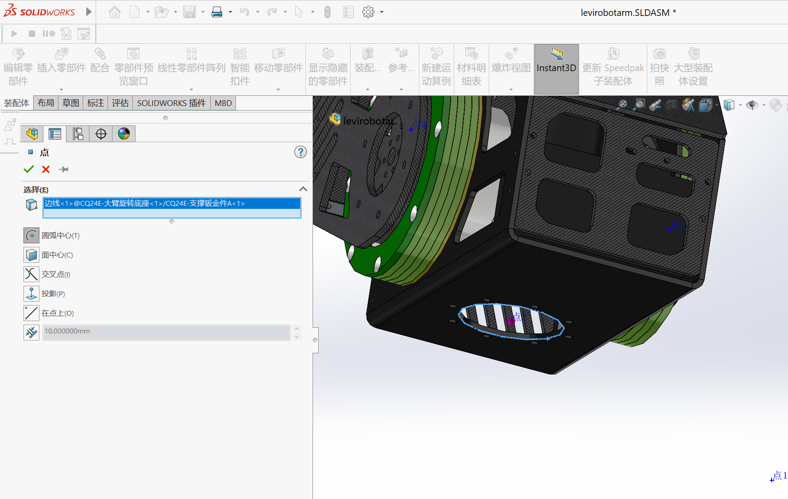

# levi_robotarm
> 课设ROS机械臂

## URDF
> 最终文件`~/catkin_ws/src/levirobotarm`

> 参考资料
> [【CSDN】特别章节-0.1 SolidWorks导出机械臂的URDF模型各个关节坐标系设置_sw2urdf导入模型如何正确设置坐标系](https://blog.csdn.net/shdhckcjc/article/details/129331111)
> [【哔哩哔哩】3.如何从零创建一个机器人模型_古月居](https://www.bilibili.com/video/BV1Mg4y127Z9?spm_id_from=333.788.videopod.episodes&vd_source=ad2e2a33b4df3234b8ee276d3b21ba03&p=3)
> [【哔哩哔哩】Xarm6机械臂——从SolidWorks导出urdf全过程【上科大 STAR中心 RIM LAB】](https://www.bilibili.com/video/BV1QKsfegEmy/)
> [【哔哩哔哩】solidworks导出urdf文件操作流程](https://www.bilibili.com/video/BV1o34y1B7e4/?spm_id_from=333.337.search-card.all.click&vd_source=ad2e2a33b4df3234b8ee276d3b21ba03)
> [【哔哩哔哩】Solidworks 插件导出 URDF](https://www.bilibili.com/video/BV1Ws4y1D7mB/?share_source=copy_web&vd_source=c31060872ab1071e0c6b7fd19c228efa)

打开CQ24E-机械臂运动装配.SLDASM

## 添加参考轴
添加基准轴目的是让关节围绕基准轴旋转，步骤如下

选择后，点击关节处电机，会生成一个轴，点击对号，工程树中选中生成的轴，右键重命名树项目为`axis_1`

依次添加参考轴
+ `axis_2`

+ `axis_3`

+ `axis_4`

+ `axis_5`

## 添加原点
添加点目的是建立坐标系原点，步骤如下

+ `point_1`

+ `point_2`

+ `point_3`

+ `point_4`

+ `point_5`

+ `point_6`

## 建立坐标系
注意事项：
Z轴要和旋转轴重合
X轴垂直相交于上一个link旋转轴

> 详情内容参考
>
> 👉[【CSDN】特别章节-0.1 SolidWorks导出机械臂的URDF模型各个关节坐标系设置_sw2urdf导入模型如何正确设置坐标系](https://blog.csdn.net/shdhckcjc/article/details/129331111)👈


+ `base_co`

最终工程树结构如下

## sw2urdf
打开插件工具

+ `base_link`
点击右侧展开模型视图，选择大臂底座

+ `link_1`

+ `link_2`

+ `link_3`

+ `link_4`

+ `link_5`

> link4和link5包含在一个总体里，要分开选

`preview and export`
每个`joint`添加`limit`

`next`->`finish`
保存名为`levirobotarm`

+ 将`/levirobotarm/launch`文件夹下`display.launch`和`gazebo.launch`内`/robots/`改为`/urdf/`
+ 将`/levirobotarm`文件夹下`package.xml`内`me2email.com`改为`me@email.com`
+ 编译
```bash
cd ~/catkin_ws
catkin_make
```
+ 运行
```bash
roslaunch levirobotarm display.launch
```

```bash
roslaunch levirobotarm gazebo.launch
```

+ `fixed frame`下拉选择`base_link`

+ `add`添加`robotmodel`
  


如要保存配置
```bash
su
cd ~/catkin_ws
catkin_make
source devel/setup.bash
```
然后再保存
## xacro
1. 创建xacro文件
```bash
cd ~/catkin_ws/src/levirobotarm/urdf
touch levirobotarm.xacro
```
复制`levirobotarm.urdf`内容到`levirobotarm.xacro`
将urdf开头
```
<robot
  name="levirobotarm">
```
修改为xacro开头
```
<?xml version="1.0"?>
<robot name="levirobotarm" xmlns:xacro="http://ros.org/wiki/xacro">
```
2. 修改launch文件
`~/catkin_ws/src/levirobotarm/launch/display.launch`
```
<param
    name="robot_description"
    textfile="$(find levirobotarm)/urdf/levirobotarm.urdf" />
```
修改为
```
<!-- 加载机器人模型参数 -->
  <param name="robot_description" command="$(find xacro)/xacro --inorder $(find levirobotarm)/urdf/levirobotarm.xacro" />
```

## MoveIt!
> 最终文件`~/catkin_ws/src/levirobotarm_moveit_config`
## 创建包
1. `MoveIt Setup Assistant`
```bash
roslaunch moveit_setup_assistant setup_assistant.launch
```
2. 选择模型
+ 创建包`create new moveit configuration package`

+ `load file`
`~/catkin_ws/src/levirobotarm/urdf/levirobotarm.xacro`

3. 自碰撞检测
`generate collision matrix`

4. 规划组
- `add group`
`~/catkin_ws/src/levirobotarm/config/kinematics.yaml`
内容如下
```yaml
manipulator:
  kinematics_solver: kdl_kinematics_plugin/KDLKinematicsPlugin
  kinematics_solver_search_resolution: 0.005
  kinematics_solver_timeout: 0.005
  kinematics_solver_attempts: 3
```

+ `add kin. chain`

+ `save`

5. 预定义姿态
- `add pose`


6. 作者信息

7. 生成配置功能包
`~/catkin_ws/src/levirobotarm_moveit_config`

## 编译测试
```bash
cd ~/catkin_ws
catkin_make
```

```bash
roslaunch levirobotarm_moveit_config demo.launch
```

勾选`Approx IK Solutions`，否则无法拖动轨迹球

如要保存配置
```bash
su
cd ~/catkin_ws
source devel/setup.bash
```
然后再保存

## Gazebo
> 最终文件`~/catkin_ws/src/levirobotarm_gazebo`
## 完善模型
1. 为link添加惯性参数和碰撞属性
打开`~/catkin_ws/src/levirobotarm/urdf/levirobotarm.xacro`
修改mass value, ixx, ixy, ixz, iyy, iyz, izz
```xml
<link
    name="base_link">
    <inertial>
      <origin
        xyz="-0.111499999999999 0.0918805537950462 0.0365980539672176"
        rpy="0 0 0" />
      <mass
        value="0.00001" />
      <inertia
        ixx="10"
        ixy="0.0"
        ixz="0.0"
        iyy="10"
        iyz="0.0"
        izz="10" />
    </inertial>
    <visual>
      <origin
        xyz="0 0 0"
        rpy="0 0 0" />
      <geometry>
        <mesh
          filename="package://levirobotarm/meshes/base_link.STL" />
      </geometry>
      <material
        name="">
        <color
          rgba="0.752941176470588 0.752941176470588 0.752941176470588 1" />
      </material>
    </visual>
    <collision>
      <origin
        xyz="0 0 0"
        rpy="0 0 0" />
      <geometry>
        <mesh
          filename="package://levirobotarm/meshes/base_link.STL" />
      </geometry>
    </collision>
  </link>
```
2. 为joint添加传动装置
打开`~/catkin_ws/src/levirobotarm/urdf/levirobotarm.xacro`，在最后一个joint标签后添加
```xml
<!-- Transmissions for ROS Control -->
  <xacro:macro name="transmission_block" params="joint_name">
    <transmission name="tran1">
      <type>transmission_interface/SimpleTransmission</type>
      <joint name="${joint_name}">
        <hardwareInterface>hardware_interface/PositionJointInterface</hardwareInterface>
      </joint>
      <actuator name="motor1">
        <hardwareInterface>hardware_interface/PositionJointInterface</hardwareInterface>
        <mechanicalReduction>1</mechanicalReduction>
      </actuator>
    </transmission>
  </xacro:macro>
  
  <xacro:transmission_block joint_name="joint1"/>
  <xacro:transmission_block joint_name="joint2"/>
  <xacro:transmission_block joint_name="joint3"/>
  <xacro:transmission_block joint_name="joint4"/>
  <xacro:transmission_block joint_name="joint5"/>
```
3. 添加gazebo控制器插件
紧接上文，在后面添加
```xml
<!-- ros_control plugin -->
  <gazebo>
    <plugin name="gazebo_ros_control" filename="libgazebo_ros_control.so">
      <robotNamespace>/levirobotarm</robotNamespace>
      <robotSimType>gazebo_ros_control/DefaultRobotHWSim</robotSimType>
      <legacyModeNS>true</legacyModeNS>
    </plugin>
  </gazebo>
```
## Gazebo文件夹

1. 创建文件夹
复制`~/catkin_ws/src/levirobotarm`并重命名为`~/catkin_ws/src/levirobotarm_gazebo`
删除meshes, textures, urdf文件夹
2. 修改CMakeLists.txt文件
`levirobotarm`改为`levirobotarm_gazebo`
```
project(levirobotarm_gazebo)
```
3. 修改package.xml
`levirobotarm`改为`levirobotarm_gazebo`
```xml
<name>levirobotarm_gazebo</name>
```
4. 执行文件
`~/catkin_ws/src/levirobotarm_gazebo`
```bash
cd ~/catkin_ws/src/levirobotarm_gazebo/launch
touch levirobotarm_gazebo.launch
```
`levirobotarm_gazebo.launch`内容如下
```xml
<launch>
  <!-- these are the arguments you can pass this launch file, for example paused:=true -->
  <arg name="paused" default="false"/>
  <arg name="use_sim_time" default="true"/>
  <arg name="gui" default="true"/>
  <arg name="headless" default="false"/>
  <arg name="debug" default="false"/>
  <!-- We resume the logic in empty_world.launch -->
  <include file="$(find gazebo_ros)/launch/empty_world.launch">
    <arg name="debug" value="$(arg debug)" />
    <arg name="gui" value="$(arg gui)" />
    <arg name="paused" value="$(arg paused)"/>
    <arg name="use_sim_time" value="$(arg use_sim_time)"/>
    <arg name="headless" value="$(arg headless)"/>
  </include>
  <!-- Load the URDF into the ROS Parameter Server -->
  <param name="robot_description" command="$(find xacro)/xacro --inorder '$(find levirobotarm)/urdf/levirobotarm.xacro'" /> 
  <!-- Run a python script to the send a service call to gazebo_ros to spawn a URDF robot -->
  <node name="urdf_spawner" pkg="gazebo_ros" type="spawn_model" respawn="false" output="screen"
	args="-urdf -model levirobotarm -param robot_description"/> 
</launch>
```
## 编译测试
```bash
cd ~/catkin_ws
catkin_make
```

```bash
roslaunch levirobotarm_gazebo levirobotarm_gazebo.launch
```


## MoveIt! + Gazebo
> [Unable to identify any set of controllers that can actuate the specified joints:-CSDN博客](https://blog.csdn.net/weixin_42314494/article/details/124022605)


> 最终文件`~/catkin_ws/src/levirobotarm_gazebo`
## joint trajectory controller
+ 配置文件
`~/catkin_ws/src/levirobotarm_gazebo/config`
```bash
cd ~/catkin_ws/src/levirobotarm_gazebo/config
touch levirobotarm_trajectory_control.yaml
```
`levirobotarm_trajectory_control.yaml`内容如下
```yaml
levirobotarm:
  arm_joint_controller:
    type: "position_controllers/JointTrajectoryController"
    joints:
      - joint1
      - joint2
      - joint3
      - joint4
      - joint5

    gains:
      joint1:   {p: 1000.0, i: 0.0, d: 0.1, i_clamp: 0.0}
      joint2:   {p: 1000.0, i: 0.0, d: 0.1, i_clamp: 0.0}
      joint3:   {p: 1000.0, i: 0.0, d: 0.1, i_clamp: 0.0}
      joint4:   {p: 1000.0, i: 0.0, d: 0.1, i_clamp: 0.0}
      joint5:   {p: 1000.0, i: 0.0, d: 0.1, i_clamp: 0.0}
```

+ 启动文件
`~/catkin_ws/src/levirobotarm_gazebo/launch`
```bash
cd ~/catkin_ws/src/levirobotarm_gazebo/launch
touch levirobotarm_trajectory_controller.launch
```
`levirobotarm_trajectory_controller.launch`内容如下
```xml
<launch>

    <rosparam file="$(find levirobotarm_gazebo)/config/levirobotarm_trajectory_control.yaml" command="load"/>

    <node name="arm_controller_spawner" pkg="controller_manager" type="spawner" respawn="false"
          output="screen" ns="/levirobotarm" args="arm_joint_controller"/>

</launch>
```

## joint state controller
+ 配置文件
`~/catkin_ws/src/levirobotarm_gazebo/config`
```bash
cd ~/catkin_ws/src/levirobotarm_gazebo/config
touch levirobotarm_joint_states.yaml
```
`levirobotarm_joint_states.yaml`内容如下
```yaml
levirobotarm:
  # Publish all joint states -----------------------------------
  joint_state_controller:
    type: joint_state_controller/JointStateController
    publish_rate: 50  
```

+ 启动文件
`~/catkin_ws/src/levirobotarm_gazebo/launch`
```bash
cd ~/catkin_ws/src/levirobotarm_gazebo/launch
touch levirobotarm_states.launch
```
`levirobotarm_states.launch`内容如下
```xml
<launch>
    <!-- 将关节控制器的配置参数加载到参数服务器中 -->
    <rosparam file="$(find levirobotarm_gazebo)/config/levirobotarm_joint_states.yaml" command="load"/>

    <node name="joint_controller_spawner" pkg="controller_manager" type="spawner" respawn="false"
          output="screen" ns="/levirobotarm" args="joint_state_controller" />

    <!-- 运行robot_state_publisher节点，发布tf  -->
    <node name="robot_state_publisher" pkg="robot_state_publisher" type="robot_state_publisher"
        respawn="false" output="screen">
        <remap from="/joint_states" to="/levirobotarm/joint_states" />
    </node>
</launch>
```

## follow joint trajectory
+ 配置文件
`~/catkin_ws/src/levirobotarm_moveit_config/config`
```bash
cd ~/catkin_ws/src/levirobotarm_moveit_config/config
touch levirobotarm_controllers_gazebo.yaml
```
`levirobotarm_controllers_gazebo.yaml`内容如下
```yaml
controller_manager_ns: controller_manager
controller_list:
  - name: levirobotarm/arm_joint_controller
    action_ns: follow_joint_trajectory
    type: FollowJointTrajectory
    default: true
    joints:
      - joint1
      - joint2
      - joint3
      - joint4
      - joint5
```
报错
```bash
[ERROR] [1729342811.504048590, 26.258000000]: Unable to identify any set of controllers that can actuate the specified joints: [ joint1 joint2 joint3 joint4 joint5 ] 
[ERROR] [1729342811.504222788, 26.258000000]: Known controllers and their joints: 
[ERROR] [1729342811.504361887, 26.258000000]: Apparently trajectory initialization failed
```
修改`ros_controllers.yaml`内容如下
```yaml
# Simulation settings for using moveit_sim_controllers
moveit_sim_hw_interface:
  joint_model_group: controllers_initial_group_
  joint_model_group_pose: controllers_initial_pose_
# Settings for ros_control_boilerplate control loop
generic_hw_control_loop:
  loop_hz: 300
  cycle_time_error_threshold: 0.01
# Settings for ros_control hardware interface
hardware_interface:
  joints:
    - joint1
    - joint2
    - joint3
    - joint4
    - joint5
  sim_control_mode: 1  # 0: position, 1: velocity
# Publish all joint states
# Creates the /joint_states topic necessary in ROS
joint_state_controller:
  type: joint_state_controller/JointStateController
  publish_rate: 50
#controller_list:
#  []
controller_list:
  - name: levirobotarm/arm_joint_controller
    action_ns: follow_joint_trajectory
    type: FollowJointTrajectory
    default: true
    joints:
      - joint1
      - joint2
      - joint3
      - joint4
      - joint5
```

+ 启动文件
`~/catkin_ws/src/levirobotarm_moveit_config/launch`
```bash
cd ~/catkin_ws/src/levirobotarm_moveit_config/launch
touch levirobotarm_moveit_controller_manager.launch
```
`levirobotarm_moveit_controller_manager.launch`内容如下
```xml
<launch>
    <arg name="moveit_controller_manager" default="moveit_simple_controller_manager/MoveItSimpleControllerManager"/>
    <param name="moveit_controller_manager" value="$(arg moveit_controller_manager)"/>

	<!-- gazebo Controller -->
	<rosparam file="$(find levirobotarm_moveit_config)/config/levirobotarm_controllers_gazebo.yaml"/>

</launch>
```

`~/catkin_ws/src/levirobotarm_moveit_config/launch`
```bash
cd ~/catkin_ws/src/levirobotarm_moveit_config/launch
touch levirobotarm_moveit_planning_execution.launch
```
`levirobotarm_moveit_planning_execution.launch`内容如下
```xml
<launch>
 # The planning and execution components of MoveIt! configured to 
 # publish the current configuration of the robot (simulated or real)
 # and the current state of the world as seen by the planner
 <include file="$(find levirobotarm_moveit_config)/launch/move_group.launch">
  <arg name="publish_monitored_planning_scene" value="true" />
 </include>

 # The visualization component of MoveIt!
 <include file="$(find levirobotarm_moveit_config)/launch/moveit_rviz.launch">
  <arg name="config" value="true" />
 </include>

  <!-- We do not have a robot connected, so publish fake joint states -->
  <node name="joint_state_publisher" pkg="joint_state_publisher" type="joint_state_publisher">
    <param name="/use_gui" value="false"/> 
    <rosparam param="/source_list">[/levirobotarm/joint_states]</rosparam>
  </node>

</launch>
```
`moveit_rviz.launch`内容如下
```xml
<launch>

  <arg name="debug" default="false" />
  <arg unless="$(arg debug)" name="launch_prefix" value="" />
  <arg     if="$(arg debug)" name="launch_prefix" value="gdb --ex run --args" />

  <arg name="config" default="false" />
  <arg unless="$(arg config)" name="command_args" default="" />
  <arg     if="$(arg config)" name="command_args" default="-d $(find levirobotarm_moveit_config)/launch/moveit.rviz" />

  <node name="$(anon rviz)" launch-prefix="$(arg launch_prefix)" pkg="rviz" type="rviz" respawn="false"
        args="$(arg command_args)" output="screen">
  <rosparam command="load" file="$(find levirobotarm_moveit_config)/config/kinematics.yaml"/>
  </node>

</launch>
```

## moveit_gazebo
启动文件
`~/catkin_ws/src/levirobotarm_gazebo/launch`
```bash
cd ~/catkin_ws/src/levirobotarm_gazebo/launch
touch levirobotarm_bringup_moveit.launch
```
`levirobotarm_bringup_moveit.launch`内容如下
```xml
<launch>
  
    <!-- Launch Gazebo  -->
    <include file="$(find levirobotarm_gazebo)/launch/levirobotarm_gazebo.launch" />

    <!-- ros_control arm launch file -->
    <include file="$(find levirobotarm_gazebo)/launch/levirobotarm_states.launch" />   

    <!-- ros_control trajectory control dof arm launch file -->
    <include file="$(find levirobotarm_gazebo)/launch/levirobotarm_trajectory_controller.launch" />

    <!-- moveit launch file -->
    <include file="$(find levirobotarm_moveit_config)/launch/levirobotarm_moveit_planning_execution.launch" />

</launch>
```

```bash
roslaunch levirobotarm_gazebo levirobotarm_bringup_moveit.launch
```


## MoveIt!编程
> 最终文件`~/catkin_ws/src/levirobotarm_demo`
> 文件改自古月居`probot_demo`

复制`probot_demo`文件并重命名为`levirobotarm_demo`
将`CMakeLists.txt`和`package.xml`文件中`probot_demo`修改为`levirobotarm_demo`

```bash
cd ~/catkin_ws
catkin_make
```
## 关节空间运动
### 正向运动学规划
+ 程序
`~/catkin_ws/src/levirobotarm_demo/scripts/moveit_fk_demo.py`程序内容如下
```python
# -*- coding: utf-8 -*-
import rospy, sys
import moveit_commander
class MoveItFkDemo:
    def __init__(self):
        # 初始化move_group的API
        moveit_commander.roscpp_initialize(sys.argv)
        # 初始化ROS节点
        rospy.init_node('moveit_fk_demo', anonymous=True)
        # 初始化需要使用move group控制的机械臂中的arm group
        arm = moveit_commander.MoveGroupCommander('manipulator')
        # 设置机械臂运动的允许误差值
        arm.set_goal_joint_tolerance(0.001)
        # 设置允许的最大速度和加速度 0~1
        arm.set_max_acceleration_scaling_factor(0.5)
        arm.set_max_velocity_scaling_factor(0.5)
        # 控制机械臂先回到初始化位置
        arm.set_named_target('home')
        # plan execute
        arm.go()
        rospy.sleep(1)
        # 设置机械臂的目标位置，使用五轴的位置数据进行描述（单位：弧度）
        joint_positions = [0.391410, -0.676384, -0.376217, 0.0, 1.052834]
        arm.set_joint_value_target(joint_positions)
        # 控制机械臂完成运动
        arm.go()
        rospy.sleep(1)
        # 控制机械臂先回到初始化位置
        arm.set_named_target('home')
        arm.go()
        rospy.sleep(1)
        # 关闭并退出moveit
        moveit_commander.roscpp_shutdown()
        moveit_commander.os._exit(0)
if __name__ == "__main__":
    try:
        MoveItFkDemo()
    except rospy.ROSInterruptException:
        pass
```
+ 运行
运行rviz界面
```bash
roslaunch levirobotarm_moveit_config demo.launch
```
运行程序
```bash
rosrun levirobotarm_demo moveit_fk_demo.py
```


### 逆向运动学规划
+ 程序
`~/catkin_ws/src/levirobotarm_demo/scripts/moveit_ik_demo.py`程序内容如下
```python
# -*- coding: utf-8 -*-
import rospy, sys
import moveit_commander
from geometry_msgs.msg import PoseStamped, Pose
class MoveItIkDemo:
    def __init__(self):
        # 初始化move_group的API
        moveit_commander.roscpp_initialize(sys.argv)
        # 初始化ROS节点
        rospy.init_node('moveit_ik_demo')
        # 初始化需要使用move group控制的机械臂中的arm group
        arm = moveit_commander.MoveGroupCommander('manipulator')
        # 获取终端link的名称
        end_effector_link = arm.get_end_effector_link()
        # 设置目标位置所使用的参考坐标系
        reference_frame = 'base_link'
        arm.set_pose_reference_frame(reference_frame)
        # 当运动规划失败后，允许重新规划
        arm.allow_replanning(True)
        # 设置位置(单位：米)和姿态（单位：弧度）的允许误差
        arm.set_goal_position_tolerance(0.001)
        arm.set_goal_orientation_tolerance(0.01)
        # 设置允许的最大速度和加速度
        arm.set_max_acceleration_scaling_factor(0.5)
        arm.set_max_velocity_scaling_factor(0.5)
        # 控制机械臂先回到初始化位置
        arm.set_named_target('home')
        arm.go()
        rospy.sleep(1)
        # 设置机械臂工作空间中的目标位姿，位置使用x、y、z坐标描述，
        # 姿态使用四元数描述，基于base_link坐标系
        target_pose = PoseStamped()
        target_pose.header.frame_id = reference_frame
        target_pose.header.stamp = rospy.Time.now()     
        target_pose.pose.position.x = -0.100901
        target_pose.pose.position.y = 0.192478
        target_pose.pose.position.z = 0.492304
        target_pose.pose.orientation.x = 0.523656
        target_pose.pose.orientation.y = -0.523583
        target_pose.pose.orientation.z = -0.475238
        target_pose.pose.orientation.w = -0.475178
        # 设置机器臂当前的状态作为运动初始状态
        arm.set_start_state_to_current_state()
        # 设置机械臂终端运动的目标位姿
        arm.set_pose_target(target_pose, end_effector_link)
        # 规划运动路径
        traj = arm.plan()
        # 按照规划的运动路径控制机械臂运动
        arm.execute(traj)
        # arm.go()
        rospy.sleep(1)
        # 控制机械臂回到初始化位置
        arm.set_named_target('home')
        arm.go()
        # 关闭并退出moveit
        moveit_commander.roscpp_shutdown()
        moveit_commander.os._exit(0)
if __name__ == "__main__":
    MoveItIkDemo()
```
+ 运行
运行rviz界面
```bash
roslaunch levirobotarm_moveit_config demo.launch
```
运行程序
```bash
rosrun levirobotarm_demo moveit_ik_demo.py
```


## 参考资料

> [【古月居】ROS机械臂开发：从入门到实战-哔哩哔哩](https://www.bilibili.com/video/BV1Mg4y127Z9?spm_id_from=333.788.videopod.episodes&vd_source=ad2e2a33b4df3234b8ee276d3b21ba03&p=3)
>
> [【古月居】ROS机械臂开发：从入门到实战-代码](https://pan.baidu.com/s/1Oy6Wm35GUrpyejAarrPGDQ?pwd=1005) 提取码：1005
>
> [【哈萨克斯坦x】ROS机械臂入门教程-哔哩哔哩](https://www.bilibili.com/video/BV1984y187Nq/?spm_id_from=333.788.videopod.sections&vd_source=ad2e2a33b4df3234b8ee276d3b21ba03)
>
> [【哈萨克斯坦x】 ros机械臂入门教程-代码 version3.0](https://pan.baidu.com/s/1KFLQXVWShG5KfroCd6eM0A) 提取码：<font style="color:rgb(51, 51, 51);">8888</font>

